【哈工大电脑110俱乐部】2022年新生购机指南

**参与人员：**

>   选购指导：杨昕昱、劳家康  
>   机型推荐：唐思琪、王梓桐、钟大柯、苏菁华、程一木、谷佳熠、蔺佳骏、王浩楠  
>   审核校对：葛煜龙、胡景祺、王永琪、梁星宇

**更新日志：**

>   20220403：完成了Part Ⅰ、Ⅱ部分的更新  
>   20220411：完成了Part Ⅲ部分的更新  
>   20220418：完成了对以上部分的校对  
>   20220425：开始更新Part Ⅳ部分  
>   20220507：完成测试版
>   20220525：完成Pre部分编写，准备发布

## 购前必看

## Pre Ⅰ如何食用本指南

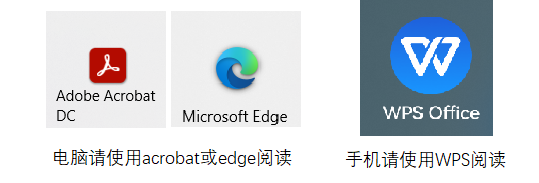

查看本指南时，手机请使用WPS打开，不要用QQ直接看；电脑可以使用Acrobat,Edge等软件打开。**本指南中蓝字为超链接，均可点击。**

**目录示意：**

**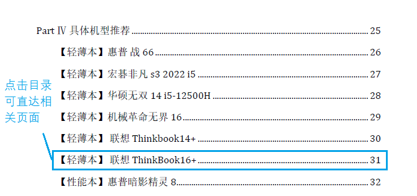**

**点击页面左下角快速返回目录：**

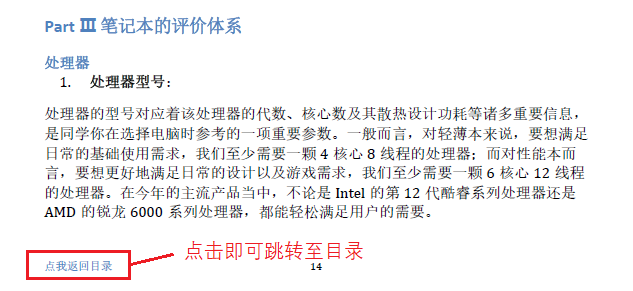

**具体机型推荐示意：**

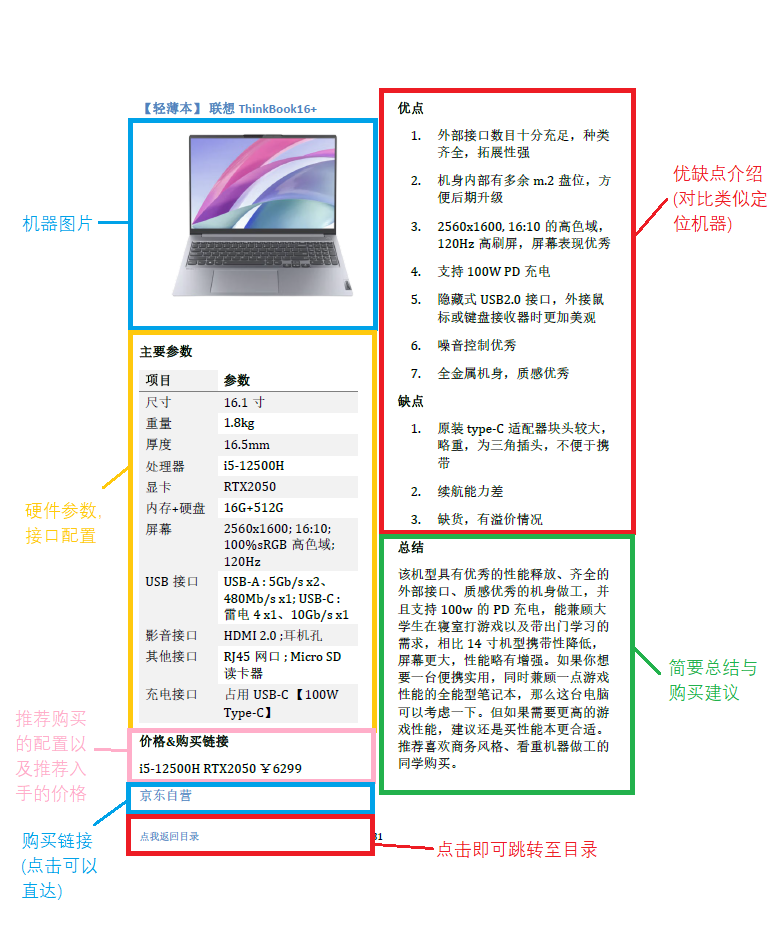

## Pre Ⅱ 选购笔记本的基本流程

### 1.确定需求

请仔细思考自己的学习与游戏需求，判断自己所需的硬件配置。目前笔记本的CPU性能基本无法构成瓶颈，一般情况下只需关注其搭载的显卡。具体选择建议详见笔记本电脑的选择部分

### 2.确定预算范围

笔记本更新换代较快，请不要盲目攀比，过分追求性能。请在自己能够承受的预算范围内购买。

### 3.挑选机型

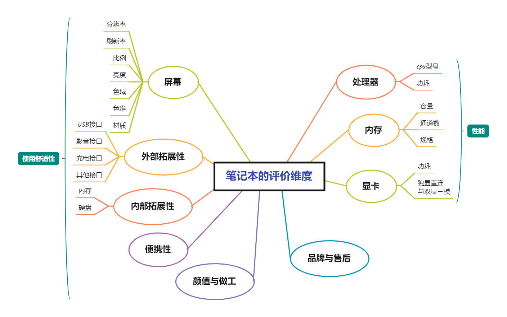

点击本指南目录即可直达对应机型的详细介绍（点击详情页面左下角可以返回目录）。我们将推荐的笔记本分为**轻薄本**与**性能本**两类，并**按照价格从低到高排序**。

详细介绍中总结了该机器在同价位中的优缺点，可根据自身需求比较购买（在确认性能需求后主要比较颜值与做工，便携性，屏幕，拓展性，品牌与售后），具体评价标准请参见评价体系部分。**对于看不懂的名词与概念，评价体系部分有详细介绍**。

关于去年的机型：本指南**只推荐近期推出的新机型**（主要为12代酷睿以及6000系锐龙），不少去年的产品性价比较高，亦可在低价促销时购买（主要渠道为拼多多百亿补贴）。但考虑到本指南主要面向购机小白，去年的机型可能存在库存、挖矿等一系列问题，**风险较高**，故不做推荐。如有此方面购机需求可以进群咨询。

### 4.购买

#### （1） 去哪买

点击本指南机型详细介绍后的链接即可直达京东自营页面（推荐使用电脑或手机WPS，手机QQ内无法直接打开链接；非常不建议更改所选配置）

若自行购买：

**首选京东自营！！！（注意分辨京东自营）**

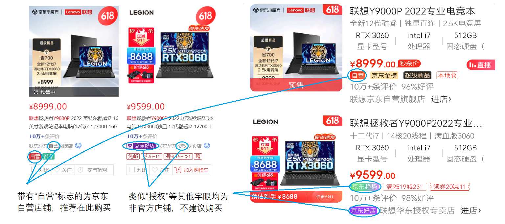

次选品牌官网，天猫官方店

不太推荐：京东非自营和淘宝（易加价减配）、拼多多百亿补贴（不建议小白购买，买到后封机的概率大大提升）、闲鱼

**不要去实体店！！！**

#### （2） 怎么买

笔记本电脑经常促销，价格波动较大，我们根据近期价格曲线总结出了该机器值得入手的**参考价格**（一般在一个月以内能够达到的促销价格）

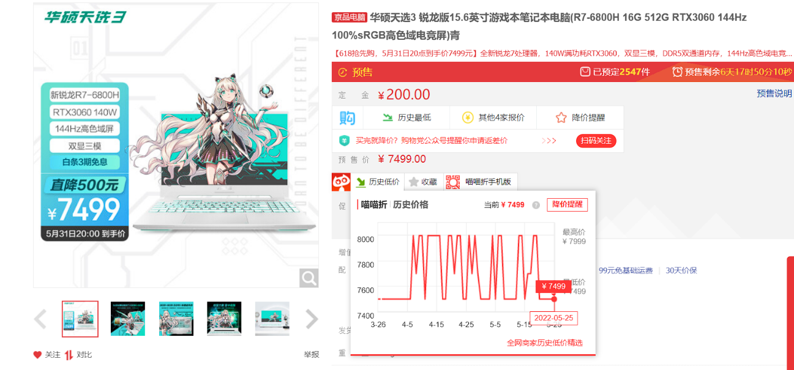

可以**根据自身需求结合当前价格与参考价格购买**，购机帮扶群中管理员也会推送近期值得入手的机器，请注意关注。

部分热门机型存在缺货情况，一般可以**看准促销或秒杀开始时间，卡点读秒抢购**。若仍然无法抢到，可以考虑**前往品牌官网或天猫官方店购买**，或者**选择同价位其他机型**。

### 其他：

对于电脑感兴趣的同学，想要深入了解笔记本选购相关知识，可以详细阅读前言部分

有任何不明白的问题欢迎加入HIT电脑110购机帮扶群：511624299 友好讨论，我社只对群中管理员的言论负责，请注意分辨！另外切勿私聊管理员，有问题请在群中与大家一起交流。

### 目录

[购前必看(如何食用本指南)](#_Toc102946991)

[1.确定需求](#1确定需求)

[2.确定预算范围](#2确定预算范围)

[3.挑选机型](#3挑选机型)

[4.购买](#4购买)

[其他：](#_Toc102946996)

[目录](#_Toc102946997)

[Part Ⅰ 前言](#part-ⅰ-前言)

[Part Ⅱ 笔记本电脑的选购须知](#part-ⅱ-笔记本电脑的选购须知)

[笔记本电脑的分类](#_Toc102947000)

[轻薄本](#轻薄本)

[性能本](#性能本)

[笔记本电脑的选择](#_Toc102947003)

[根据专业需求选购不同类型的笔记本电脑](#根据专业需求选购不同类型的笔记本电脑)

[根据游戏需求选购不同类型的笔记本电脑](#根据游戏需求选购不同类型的笔记本电脑)

[根据个性化需求选购笔记本电脑](#根据个性化需求选购笔记本电脑)

[笔记本电脑的购买渠道](#笔记本电脑的购买渠道)

[Part Ⅲ 笔记本的评价体系](#_Toc102947008)

[处理器](#处理器)

[内存](#内存)

[显卡](#显卡)

[屏幕](#屏幕)

[扩展性](#扩展性)

[Part Ⅳ 具体机型推荐](#part-ⅳ-具体机型推荐)

[【轻薄本】惠普 战66](#轻薄本惠普-战66)

[【轻薄本】宏碁非凡s3 2022 i5](#轻薄本宏碁非凡s3-2022-i5)

[【轻薄本】华硕无双14 i5-12500H](#轻薄本华硕无双14-i5-12500h)

[【轻薄本】机械革命无界16](#轻薄本机械革命无界16)

[【轻薄本】 联想 Thinkbook14+](#轻薄本-联想-thinkbook14)

[【轻薄本】 联想 ThinkBook16+](#轻薄本-联想-thinkbook16)

[【性能本】惠普暗影精灵8](#性能本惠普暗影精灵8)

[【性能本】宏碁 暗影骑士·擎 2022](#性能本宏碁-暗影骑士擎-2022)

[【性能本】机械革命极光Pro i7 3060](#性能本机械革命极光pro-i7-3060)

[【性能本】华硕天选3](#性能本华硕天选3)

[【性能本】联想Y9000P i7+3060](#性能本联想y9000p-i73060)

[【性能本】魔霸新锐 R9+3060](#性能本魔霸新锐-r93060)

## Part Ⅰ 前言

在2021年夏季，我们哈尔滨工业大学电脑110俱乐部为大家撰写了2021年的新生购机指南，并得到了广泛的传播，截止目前，仅义诊群和购机群中各版本购机指南的下载量就已突破5700人次，为我校甚至是其他学校的广大师生们的购买决策提供了重要参考。如今，一年的时间过去，笔记本电脑市场的格局又迎来了深刻的变化，原本于2021年编写的购机指南已不再具有时效性，故在此进行年度更新。若同学你在阅读本指南的过程当中有任何疑问，欢迎你加入HIT电脑110购机帮扶群：511624299，我们会为你做出合适的推荐。

## Part Ⅱ 笔记本电脑的选购须知

### 笔记本电脑的分类

各大厂商，乃至于各大评测媒体为笔记本电脑产品进行分类的初心，是帮助广大消费者做出更适合自身需求的选择。在去年的购机指南当中，我们社团虽然已经根据各笔记本电脑的性能高低与尺寸大小做出了精简分类的决定，将笔记本电脑划分为轻薄本、全能本以及游戏本共三大门类。但今年的局势又有所不同，一方面，上游制造商间的竞争使得一大批性能强劲的新式硬件纷纷显现，未来两年内，传统定义中的全能本将会彻底消失；另一方面，各大厂商对于市场份额越发激烈的争抢使得市场上出现了越来越多的越级产品，而它们都毫无疑问地成为了爆款。故我们决定大胆地精简对于笔记本电脑的分类，即把笔记本电脑分为轻薄本和性能本这两类。**Mac以及工作站等特殊类型的笔记本电脑，并不太适合绝大多数同学的需求，在此不做讨论。**

### 轻薄本

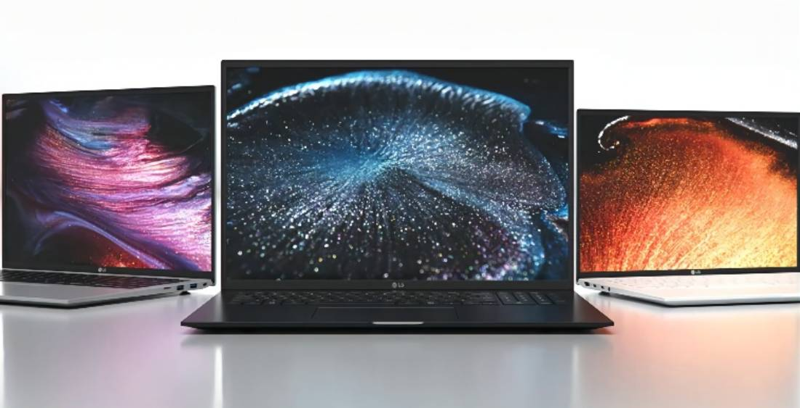

**轻薄本的购买建议**：

1.  轻薄本已经能够满足绝大多数用户的使用需求。所以当同学你的日常使用需求对笔记本电脑图形性能要求相对较低，又对笔记本电脑便携性有一定要求时，一台配置合理的轻薄本将会是你的不二选择。
2.  轻薄本间的图形性能差距已经越来越小，不论是Xe、Radeon集成显卡还是GeForce独立显卡均可以流畅运行如LOL、DNF、CSGO等轻度游戏，以是否搭载独立显卡作为是否为轻薄本的方法早已不再具有普适性。然而，尽管用户的日常使用环境对于各型号显卡具有拉平效应，但是面对如DOTA2、原神这类对于笔记本电脑图形性能有一定要求的游戏或者是一些视频剪辑任务时，搭载GeForce RTX2050以及RTX3050的产品明显会具有更好的表现。
3.  轻薄本的价位跨度相当大，从3000元到20000元都有对应产品分布，但是各产品之间的价差其实更多地会体现在机身做工和品牌溢价上，它们彼此之间的性能差别其实并不大。

### 性能本

**性能本的购买建议**：

1.  性能本常常被人们称作游戏本，并因此遭到许多家长的偏见，但游戏却只是性能本最基础的用途，性能本在事实上也能够承担一些如视频剪辑、数据分析等低烈度的生产力任务。然而，为了维持这样的性能释放，性能本花费了大量的空间安装散热风扇、热管、均热板等散热硬件，这使得性能本普遍会比轻薄本沉重许多。所以当同学你的日常使用需求对笔记本电脑的性能要求较高，并且对笔记本电脑的便携性不那么在意，那么选购一台性能本是正当合理的。
2.  虽然性能本的屏幕素质、拓展能力、颜值做工、软件控制等参数也是重要的评价标准，但是我们始终认为评价一款性能本的优劣的最根本标准就是其性能释放强弱，更强大的性能释放当然就意味着更快的图形处理效率和更好的游戏体验，而它的影响有时甚至超过了独立显卡的型号，编者将在下文中详细说明。
3.  今年市场上的性能本市场环境可以说是错综复杂。一方面，受到移动端平台性能释放限制，NVIDIA全新推出的RTX3070Ti及RTX3080Ti显卡无法产生较为明显的性能提升；另一方面，各大厂商纷纷在搭载新一代AMD和Intel处理器的高端产品线上选择了DDR5内存，这带来了相当的价格上涨；可同时，具有更高性价比的老产品却又受到矿机回流因素的影响，其品质令人堪忧。因此，我们推荐各位同学选择购买搭载RTX3070Ti及以下显卡的机型，若同学你对电脑的图形性能有更高的要求，我们会更建议你组装紧凑型MATX或者ITX的台式电脑。

### 笔记本电脑的选择

鱼，我所欲也，熊掌亦我所欲也；二者不可得兼，舍鱼而取熊掌者也。选购笔记本电脑时，即是在经费预算、性能释放、机身尺寸、颜值做工等因素之间做出合乎个人实际的取舍。回顾近三年的笔记本电脑市场中那些红极一时的明星产品，它们无一不是在多因素的斡旋中做出了适度的妥协。下面，我们将列举我们于《2021年新生购机指南》中强烈推荐的几款笔记本电脑产品，事实上，它们也是去年市场中的明星产品，以此说明背后的规律。

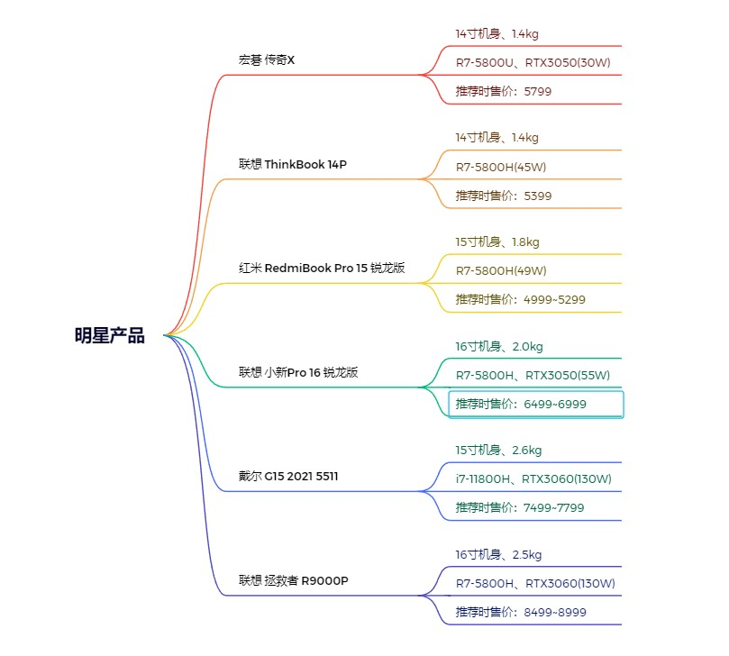

在这六款机型中，前三款属于轻薄本，而后三款属于性能本。根据去年我们在购机群的反馈结果，我们可以发现大部分的新生在购买轻薄本时的预算在五千元左右，要求性能释放与做工品控兼顾；而购买性能本时，同学们会更倾向于于溢价少、售后良好的产品，并且普遍会选择RTX3060显卡。不过有趣的是，联想的笔记本电脑凭借优秀的宣发水平及针对性的产品定位，赢得了许多同学的好感，也使他们愿意承担一定的溢价购买。虽然我们的统计结论并不能真正代表同学你最终的决策，但是看到这里，相信你已至少对笔记本电脑的选择过程有了一个初步的认识。

### 根据专业需求选购不同类型的笔记本电脑

在全日制本科学校中，不同的专业对笔记本电脑性能的要求是不一样的。对于处理器、显卡性能要求都低的专业自然就只需要用到轻薄本；对于处理器要求高，但却对显卡要求低的专业，比如土木工程学院，就可以直接选购处理器性能释放良好的轻薄本；而对于处理器、显卡性能要求都比较高的专业，比如建筑学院，即便是性能本的性能也无法满足他们的需要，故许多同学往往是先买了轻薄本，后期再更换台式电脑。所以对于我们哈尔滨工业大学目前所有的学科，同学们大致可以参考如下表格:

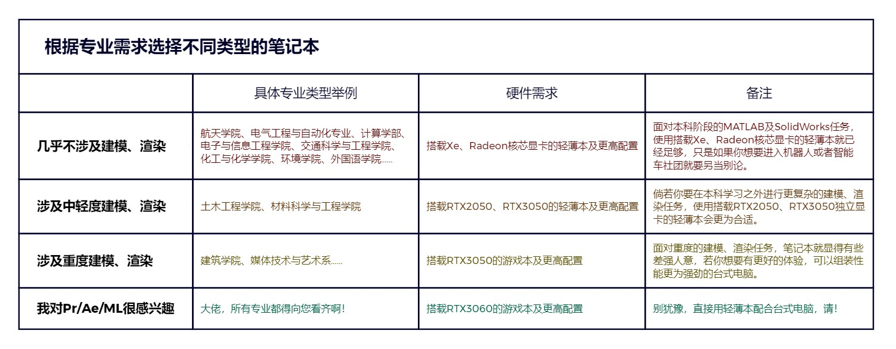

### 根据游戏需求选购不同类型的笔记本电脑

游戏性能的高低是消费端电脑性能强弱的最直接体现，也是厂商营销宣传的重要卖点。虽然处理器和显卡的性能高低都会对电脑的游戏性能造成影响，但在当前的笔记本电脑市场环境中，升级显卡对于玩家游戏体验的提升是最大的。在此我们列出了今年新款笔记本电脑产品所能够搭载的主流显卡类型，各位同学可以根据你所想玩的游戏在此进行一定程度的参考：

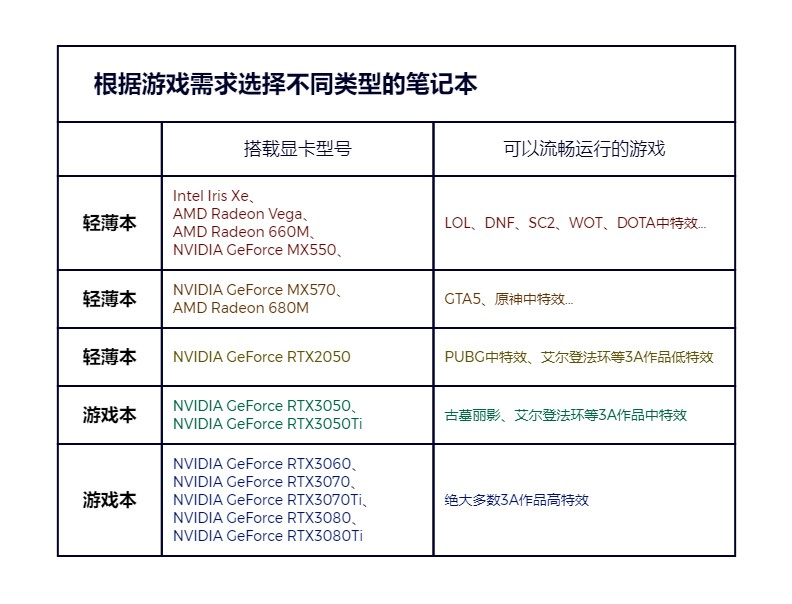

### 根据个性化需求选购笔记本电脑

近年来笔记本电脑市场上掀起了一股以性能论高低的热潮，几乎所有位于主流价位段的性能本、全能本和轻薄本，厂商都会标明自己的最大功耗以夸耀产品的性能，这样的孤立片面的导向在一定程度上误导了消费者。虽然笔记本电脑的性能释放对于笔记本电脑来说是一个相当重要的参数，但是屏幕素质、续航能力、品控做工也同样重要，如果同学你已经明确自己对于笔记本电脑没有较高的性能需求，那你当然可以选择一款做工精致的轻薄本。但是我们必须要提醒的是，在市场经济当中，消费者对于个性的追求意味着他们要为此付出更多的金钱，烦请各位同学在选购产品时量力而行，发扬勤俭节约的精神。

### 笔记本电脑的购买渠道

当确定好自己心仪的笔记本电脑之后，似乎我们只需要找到这款笔记本然后购买就可以了？如果同学你在此时放松了警惕，对于商家的套路把握不清，就很容易落入他们的陷阱，以至于白白亏损自己的时间和金钱，这怎么能不令人感到懊悔呢？对各个笔记本的购买渠道进行了解，做出合适自己的选择，不在最后给自己留下任何遗憾。下面是一些常见的笔记本购买渠道，编者将会根据综合推荐程度对它们进行排序，并对这些购买渠道进行点评：

**1.京东自营、天猫官方旗舰店、品牌官方商城**：

线上客服服务干练，绝不拖泥带水；品牌售后服务周到，支持7天无理由退货；产品配置高度统一，与官方宣传一致。

**2.华为、小米、苹果/微软等品牌的线下直营店**：

直营店铺真机体验，便利购买决策；产品配置高度统一，与官方宣传一致；品牌售后服务优秀，但可能与线上平台有所区别。

**3.拼多多百亿补贴**：

正规渠道正品保证，但不保证全新；百亿补贴重拳出击，价格击穿心理防线；平台售后服务相当一般，存在踢皮球现象。

**4.eBay、Amazon海淘**：

适合购买如ThinkPad、ROG、Alienware、Razer等在国内外差价巨大的电脑，但仅适合极其了解海淘市场的车王。

**5.闲鱼交易平台**：

在闲鱼上买笔记本电脑如同炼丹，所以仅适合身经百战的老懂哥和神勇异常的小萌新。

**不要在一般实体店铺买电脑！** **不要在一般实体店铺买电脑！** **不要在一般实体店铺买电脑！**

一般来说，我们俱乐部每年会维修维护约近千台各类电脑，在这样的过程当中，我们经常会遇到一些在一般非官方直营的实体店铺购买笔记本电脑的机主。但令我们感到惊讶的是，尽管这样的实体店铺在网络上早已臭名昭著，每年依然会有相当数量的同学在这些店铺购买笔记本电脑，其原因也无外是他们的父母在其中认识朋友。俗话说生人宰一半，熟人大满贯，这些店铺把熟人坑惨的经历已经是屡见不鲜，靠的就是以假乱真，鱼目混珠之章法。

根据我们俱乐部的过往经验以及一些网友的不幸遭遇，我们大抵可以总结出实体店铺的套路。首先，店铺销售人员普遍存在模糊各项参数的故意，提出一些明显有误的概念，并且通过你的反应来试探你对硬件的认识水平；之后，当它们确认你的认识水平并不高后，他们会为你列出一系列的机型，并想办法诱导你购买使他们利润最大化的产品，甚至是旧机型，但若你选择了性价比较高的机型，他们也可能会采取诸如产品没货、故意使电脑蓝屏等手段让你改变选择；其次，即便你成功买到了你想要的机型，你也依然要注意到实体店铺的配置不透明性，许多笔记本电脑的内存、硬盘、网卡都是可以更换的，更有一些厂商专门为线下渠道提供的机型提供较差素质屏幕的先例；最后，实体店常常会以各种缘由拒绝向你提供发票，以至于你在意识到自己被坑之后也维权无门[1]。跟这群虫豸在一起，怎么能买好电脑呢？

相信各位同学通过对以上内容的阅读，已经充分了解适合自己的笔记本电脑类型以及选择何种购买渠道进行购买了。接下来的一小段内容属于我们社团的笔记本电脑评价体系展示，感兴趣的同学可以进行了解，不感兴趣的同学可以下滑至具体机型推荐。

## Part Ⅲ 笔记本电脑的评价体系

### 处理器

**1.处理器型号**：

处理器的型号对应着该处理器的代数、核心数及其散热设计功耗等诸多重要信息，是同学你在选择电脑时参考的一项重要参数。一般而言，对轻薄本来说，要想满足日常的基础使用需求，我们至少需要一颗4核心8线程的处理器；而对性能本而言，要想更好地满足日常的设计以及游戏需求，我们至少需要一颗6核心12线程的处理器。在今年的主流产品当中，不论是Intel的第12代酷睿系列处理器还是AMD的锐龙6000系列处理器，都能轻松满足用户的需要。

Intel第12代酷睿系列处理器通过引入类似于移动端ARM处理器的异构多核技术，在多核性能上实现了几乎翻倍的提升；而AMD锐龙6000系列处理器虽然在处理器性能上没有可观的提升，但是其搭载的RDNA2架构集成显卡，一扫以往集成显卡性能孱弱的印象，更为轻薄本用户带来了意外惊喜。

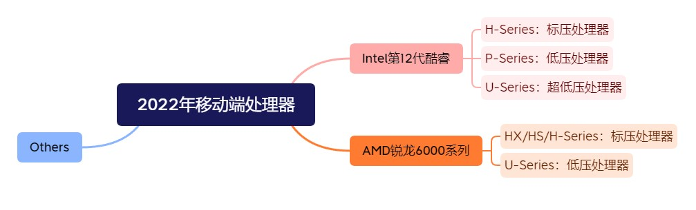

**2.处理器散热设计功耗**：

受厂商营销话术及产品实际体验的影响，不少用户对于处理器的选择有着固有的认识，常常会有认准搭载某一厂商、某一产品线处理器的机型进行购买的现象。这样的认识固然有其道理，但也会终究会随着时代的变化而失准，反而会干扰消费者做出合适的选择。

需要明确的是，任意厂商下属的任意产品线所生产的任意处理器，其最终的性能发挥最终也不能脱离其在具体机型的功耗发挥影响。颠覆许多人认识的是，其实低压处理器的体质都会略好于比标压处理器，这使得这些处理器可以以更低的功耗达成更高的性能。实际上，在近几年的处理器产品当中，也只有酷睿系列处理器对于低压处理器和标压处理器的核心数量以及显存大小做出了明确的划分。既然如此，为什么厂商还要宣传标压处理器性能强于低压处理器呢？

这时我们就要引入散热设计功耗这一概念了，其指的是芯片默认在长时间运行时所能允许的最大功耗，该值可被设备生产商更改，是衡量处理器性能强弱的重要指标。在此，我们利用搭载R7-5800U的战66与搭载R7-5800H的ThinkBook14p做对比，它们的处理器散热设计功耗分别为25W和45W，故在CinebenchR20多线程项目的跑分上，前者成绩为3700分[2]，而后者的成绩为4500分[3]，领先约20%。

据此，消费者在选择笔记本电脑产品时，并不应当迷信于某一生产线，而更应该考虑到实际自己的需要，充分地考虑自己的实际需求，自己是更需要良好的续航还是出色的性能？为了追求这一项指标，自己又愿意多承担多少预算？相信你可以得出相应的结论。

### 内存

**1.内存容量**：

新冠疫情爆发以来，大多数经历过线上教学的学生都会产生这样一种感受，那就是8GB的内存大小已经不再能够满足他们的日常需求了。时代的发展已经证明，越来越多的学生，尤其是那些选择了建筑和数媒专业的学生，在他们的后续使用中需要有32GB甚至是更大的内存空间，所以，搭载16GB大小的内存已经成为了当今所有新款笔记本的立足之本，倘若一款笔记本电脑并未搭载16GB大小的内存，我们绝对不会让它出现在我们的购机指南上。而关于内存的扩展性问题，我们将在下文中的有关部分进行详细介绍。

**2.双通道内存**：

如果同学你曾经上过信息技术课，那你可能会从老师那里听过双通道这个概念，由于对于内存工作原理的解析涉及到一些晦涩的知识，在此我们可以做一个比较恰当的比喻。如果把内存和处理器比作两地，则内存通道就相当于其中的公路，通行在公路上的车辆就是数据。而影响车辆通行效率的因素一个是车辆的速率，另一个就是公路的宽度以及数量，一般而言，公路的数量越多，两地之间的交互也就越便利。因此在其他参数相同的基础上，即便都是16GB大小的内存，单条16GB的内存的实际性能表现是不如两条8GB的内存的，而且这样的性能差距有时甚至如同更换了一张显卡[4]。  
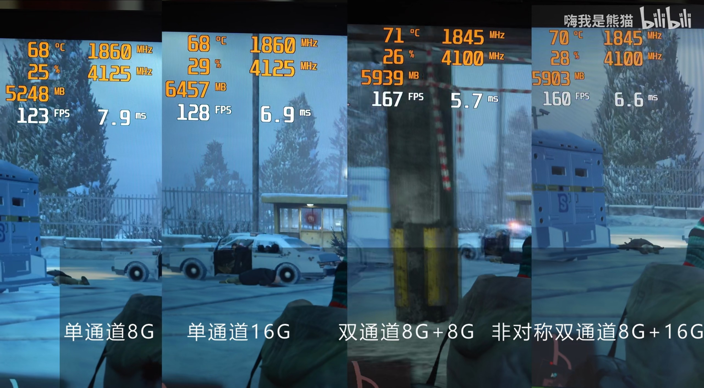

**3.内存规格**：

当今市场上主流的内存规格是DDR4，而今年也是DDR5规格内存的元年，第12代酷睿系列处理器同时支持DDR4和DDR5两种规格，而锐龙6000系列处理器则是仅支持DDR5规格。不过不用看当前厂商如何宣传DDR5，关于DDR5内存的特性及其最终的性能表现，我们完全可以类比专业工作站这样的高内存带宽、高内存延迟的平台，事实结果也与该类比一致：从消费者的角度来看，初代的DDR5内存除了在极少部分的专业软件上胜出，在大多数的专业软件和几乎所有的游戏上都不如现今的DDR4内存，而且在未来的一至两年内，DDR5内存的价格都会维持在一个较高的水平，这意味着打算升级内存空间用户将要多花一倍的成本[5]。故某款机器搭载了DDR4内存，或是在搭载DDR5内存的基础上仍然保持在较低的价格，我们都会将其视为优点。

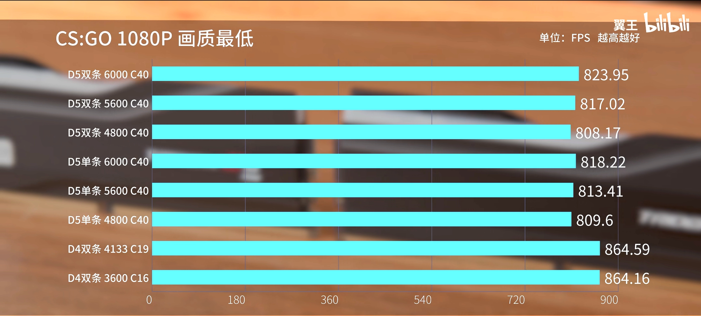

### 显卡

#### **集成显卡**

说到集成显卡，就不能不提到今年锐龙6000系列处理器搭载的RDNA2架构集成显卡及其堪称革命性的性能提升，在DDR5-4800Mhz内存的加持下，R7-6800U搭载的680M集成显卡的性能在多数测试项目当中小幅超越了NVIDIA的MX550独立显卡[6].虽然集成显卡的相关驱动还有待着后续完善，不过这意味着MX系列的独立显卡会在不远的未来退出硬件舞台，进入历史的垃圾桶中。

不过也正因如此，同学你在购买的是搭载集成显卡的轻薄本时，需要留意一下其搭载内存的规格，这是因为集成显卡的性能极大程度地受到了内存带宽的影响。比如在去年的市场上，主流的笔记本电脑会搭载LPDDR4x-4266MHz或者DDR4-3200MHz的内存，在其他条件相同的基础上，前者的集成显卡性能比后者要强4%\~17%[7]。更不用说今年的市场上除了传统DDR4规格的内存外还出现了LPDDR5-5200MHz以及DDR5-4800Mhz的内存，集成显卡之间的差距也会因此而变大。

#### **独立显卡**

虽然在去年，AMD全新推出的基于RDNA2架构的RX6000系列独立显卡令人眼前一亮，但受种种因素影响，其售价及性能依然不敌NVIDIA的RTX30系列独立显卡。在今年的市场环境中，RTX30系列显卡依然是独领风骚，可令人感到遗憾和愤怒的是，NVIDIA于今年全新推出的RTX3070Ti和RTX3080Ti的性能提升不如人意，而将最高功耗解锁至140W的RTX3060更是几乎没有提升。考虑到桌面端显卡价格的大幅下降，且移动端RTX3080Ti的性能也落后于桌面端的RTX3070，因此我们更建议同学你购买配置在RTX3070Ti以下的笔记本电脑，并在有更高图形性能需求时购买台式电脑。

**1.显卡散热设计功耗**：

唐代文学家韩愈曾经在人才问题上发出过这样的议论：是马也，虽有千里之能，食不饱，力不足，才美不外见，且欲与常马等不可得，安求其能千里也？不论是处理器、显卡还是电脑上的其他元器件，要想发挥他们的千里之能，一个必要条件就是让它们食饱力足，满足这些元器件的功耗需求。与处理器一致，电脑生产厂商们也为他们产品中搭载的独立显卡标定了一个散热设计功耗。在去年的市场当中，我们可以看到，性能释放强大的RTX3060机型相比于性能释放平庸的同类机型，在图形性能会强约16%，而这一差距近乎于将RTX3060升级至RTX3070[8]。

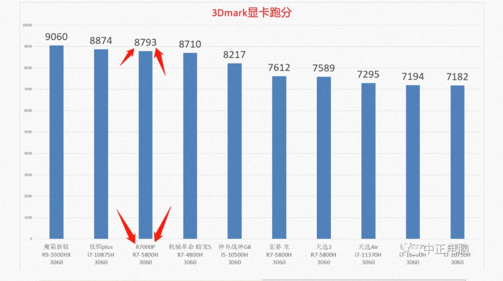

不过，基于集成电路特性，芯片功耗的增加对于性能的提高存在边际效应。在去年市场的中，性能释放最为出色的RTX3060机型往往采用的是基础功耗115W，动态增强15W，最大功耗130W的方案，今年厂商将RTX3060显卡的动态增强部分调整至25W，使最大功耗达到了140W。可是尽管厂商宣称这样的设计可以带来更为澎湃的性能并声称这是满血方案，但该设计在实际的测试中却只能带来1%的性能提升，在实验误差范围内[9]。

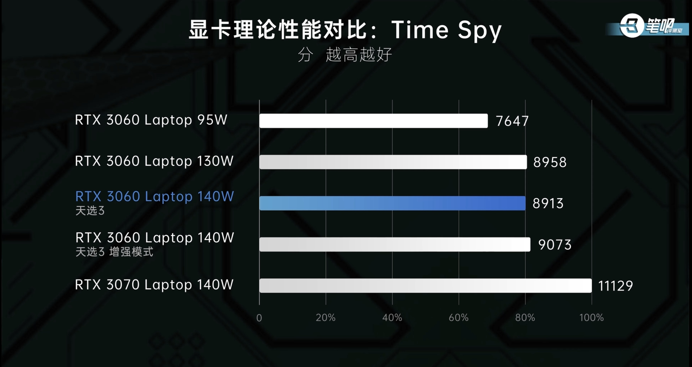

**2.独显直连与双显三模**：

独显直连，指的是笔记本电脑直接屏蔽其搭载的集成显卡，由高性能的独立显卡直接输出信号流的工作模式。与厂商在宣传时的相反，独显直连实际上并不什么新奇的工作模式，那些由独立显卡输出视频信号的台式电脑采用的都是独显直连；而在笔记本电脑发展的早期，采用独显直连模式不仅不会大幅提高电脑的性能，反而会极大地降低笔记本的续航时间。所以在先前，独显直连模式仅仅是为少数的高性能笔记本支持，只是一个聊胜于无的卖点罢了。

但是伴随着芯片工艺的突飞猛进，以往由集成显卡为显示器输出信号流的方案已经不能为广大笔记本使用者所接受，所以独显直连技术又重新登上了笔记本市场的主舞台。为了更好地展示出独显直连对于电脑性能的提升，我们以天选2为例：当天选2使用自带的屏幕时，其工作模式为独显计算，集显输出的混合模式；当天选2外接屏幕时，其独立显卡得以直接为显示设备输出信号流，等效于开启了独显直连。测试表明，天选2在独显直连模式下的游戏帧率都有不同程度上的提升，而对于一些对处理器性能有一定要求的游戏，这样的提升甚至是翻倍的[10]。

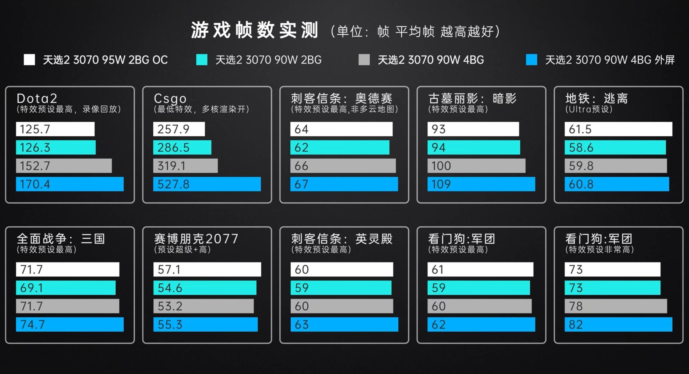

不过需要表明的是，开启独显直连虽然能够带来一定的性能提升，但也会使得笔记本电脑的续航时长大幅下降。所以在今年的市场上，厂商又开始宣传他们的双显三模技术。双显指的就是笔记本上的集成显卡与独立显卡；三模分别指的是集显模式、混合模式、独显模式。双显三模技术允许用户在根据自己的实际使用环境做出不同的切换，在续航和性能之间做出灵活的取舍。

### 屏幕

对于绝大多数的用户而言，不管一款笔记本电脑的性能到底如何强劲，屏幕才是该电脑与用户直接交互的窗口。因此，笔记本电脑的屏幕素质好坏也是评价一款笔记本电脑产品的重要标准。但是涉及屏幕好坏的参数相当多，有分辨率、刷新率、比例、亮度、色域、色准、背光、对比度、均匀度、响应时间、调光模式、材质、功耗、电磁辐射等多个参数，令人色难。所以在此我们选择了7个比较重要的参数作为我们的评价标准，希望能对同学你有所帮助。

**1.屏幕分辨率**：

屏幕分辨率，指的是量测或显示系统对细节的分辨能力，在同一尺寸规格的显示系统下，分辨率越高代表影像质量越好，越能显示出更多的细节。一般而言，我们都会推荐同学你选择分辨率为1920x1080或以上的屏幕配置。事实上，在去年的笔记本电脑市场中，主流价位段出现了很多搭载2560x1440分辨率或更高分辨率屏幕的轻薄本，有的甚至下探到了四千元价位，故厂商已经没有太多的借口不为他们的轻薄本搭载2560x1440或更高分辨率的屏幕。不过值得注意的是，更高分辨率的屏幕不仅对电脑的图形性能和有了更高的要求，若同学你的显卡为RTX3060以下且你有比较高的游戏需求，我们并不建议你选择分辨率比1920x1080更高的屏幕；同时我们也不建议你盲目选择搭载3840x2160屏幕的机型，这是因为许多软件对于这一级别的显示器优化不足，使得你在运行这些软件时出现字体过小的现象。

**2.屏幕刷新率**：

屏幕刷新率，指的是屏幕每秒钟所能显示的画面帧数。由于人眼的视觉暂留效应，显示系统的画面快速播放时，就能够使画面变得连续起来，而从这一角度来看，屏幕刷新率自然是越高越好。目前，越来越多的轻薄本和性能本都搭载了刷新率在90Hz以上的屏幕，高刷新率屏幕不仅可以使得用户的游戏体验更佳，也可以使用户在浏览信息流时感到更加自然，不过这样的代价就是屏幕功耗的上升。经过我们的实际的体验和对其他用户评价的采集，我们认为搭载90Hz或120Hz刷新率的屏幕在轻薄本上表现相当不错；而性能本就需要144Hz或更高的刷新率，但即便是电子竞技职业选手，也很难区分刷新率在240Hz以上的屏幕。

**3.屏幕比例**：

屏幕比例，指的是屏幕的宽度和高度的比例。比起传统那些屏幕比例为16:9的屏幕，屏幕比例为16：10或3：2的屏幕在进行文字、编程、剪辑工作时能够显示出更多的内容，更利于用户的学习工作，确实是一项优点。

**4.屏幕亮度**

屏幕亮度，顾名思义指的就是屏幕的明亮程度。不管是那些习惯将笔记本电脑携带至图书馆或者教室等场所的同学，还是对于那些喜欢在宿舍玩游戏的同学来说，过低的屏幕亮度会使得屏幕的显示内容难以分辨，使他们的学习效率或者娱乐效果大大降低，故尽管屏幕亮度参数的提升会影响屏幕的色阶、灰阶等性能，并收到其他屏幕参数的制约，我们也依然会比较推荐最大亮度更高的屏幕。

**5.屏幕色域**：

屏幕色域，又称屏幕色彩空间，指的是屏幕显示的色彩丰富度，屏幕色域越大，能显示的色彩就越广。在此，我们原则上推荐选购72%NTSC色域和100%sRGB及以上色域的屏幕配置，但由于更广的色域，如DCI-P3和Adobe RGB在Windows操作系统下的支持其实并不好，只推荐有专业修图需求的同学进行选购[11]。对此，为了方便同学你的选择，我们会以72%NTSC和100%sRGB作为高色域的分界线，以上的称之为广色域，以下的称之为低色域。

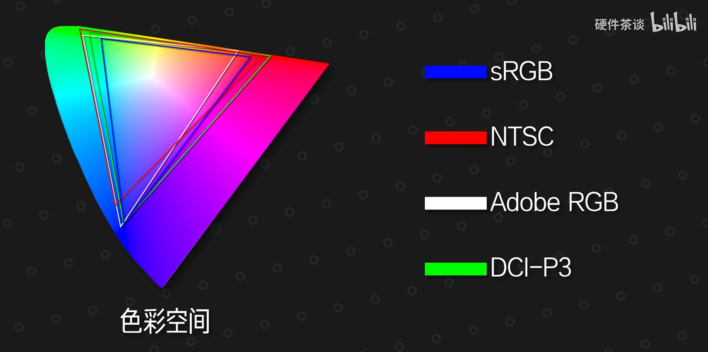

**6.屏幕色准**：

屏幕色准，指的是屏幕显示色域范围内显示色彩的准确度，屏幕色准越好，就越能精准地显示出色彩在该显示范围内应有的色彩。不过由于屏幕生产技术的发展，一般也很少会有色准非常差的屏幕，故对于绝大多数用户而言，屏幕色准并不是非常重要。因此，除了有重度图片、视频编辑工作需要的同学需要注意该参数外，其他同学并不需要对此在意。

**7.屏幕材质**：

在目前的笔记本市场上，我们已经很难找到TN或者VA材质的屏幕了，绝大多数的笔记本电脑都搭载了IPS屏幕，当然也有部分高端笔记本电脑搭载AMOLED屏幕。虽然AMOLED屏幕在功耗更低的基础上实现了更低的色域和更高的亮度，但是也有着容易烧屏的缺陷，并且这些笔记本电脑大多在低亮度时采用低频PWM调光技术，其频闪可能会导致人眼的不适。综上，我们建议同学你不要盲目追求体验新技术，而要根据自己的实际需要进行选择。

### 扩展性

#### **外部扩展性**

**1.USB接口**：

USB接口是一种输入输出接口的技术规范，而目前笔记本电脑上通常搭载的是其中的Type-A以及Type-C接口，支持协议从USB2.0至USB4.0不等，但是由于USB协议标准已经经历了多次更新，且不同电脑生产商描述的习惯存在差异，区分其实际速率变得相当烧脑。故在本指南当中，为方便各位同学区分这些接口，我们将直接用该接口的速率进行描述，此时请你注意我们的单位为Gb/s或者Mb/s，与实际的GB和MB存在有8:1的转换关系。

对于轻薄本而言，以配备至少2个Type-A接口和1个Type-C接口为佳；而对于性能本而言，以配备至少3个Type-A接口和1个Type-C接口为佳。除此之外，在接口速率方面，以5Gb/s为合格，10Gb/s为良好，20Gb/s为优秀；最后就是对于搭载Intel处理器的笔记本电脑，则其Type-C接口应当以支持Thunderbolt4标准，即雷电4标准为宜。

**2.影音接口**：

由于我校宿舍环境的改善，越来越多的同学考虑在宿舍内购置一台显示器，此时笔记本电脑的视频传输接口就变得尤为重要。而对于轻薄本而言，由于其机身厚度限制，常常不会配备HDMI或者Mini DP接口，故其Type-C接口应当支持视频输出功能，即所谓的全功能Type-C；而对于那些性能本而言，其应当配备至少一个HDMI接口、Mini DP接口或全功能Type-C接口。在支持协议上，需要注意的是，HDMI2.0协议的带宽最大只能支持到1920x1080分辨率240Hz帧率或2560x1440分辨率144Hz帧率的视频流传输，并且部分HDMI2.1协议的接口存在虚标，因此若你的显示器刷新率达到2560x1444分辨率165Hz帧率甚至更高，请检查你的笔记本电脑上的接口协议是否确实为HDMI2.1、DP1.2及DP1.4，而全功能Type-C接口一般可以直接转接DP1.2，相当方便。

而在音频接口方面，考虑到很多同学需要在图书馆或者教室等公共场所自习，因此任何未配置耳机耳麦孔的笔记本电脑都应当遭到最严厉的批判，并广泛地通知消费者。要注明：任何为消费者的使用添堵的设计都是要被挂在历史的耻辱柱上的！

**3.充电接口**：

我们非常乐意看到目前市场上越来越多的笔记本电脑支持PD协议，所谓PD协议，全称USB Power Delivery，是一种充电协议与接口的标准，统一采用Type-C接口进行供电，可以使用户携带更少的充电适配器，并且更为方便地更换这些设备，现已被绝大多数的安卓设备、从iphone8起的苹果设备、绝大多数轻薄本以及少数性能本支持，在设备与适配器成功握手的前提下，其最大充电功率可以突破100W。在当下，轻薄本没有配备PD协议接口是极大的劣势，这意味着用户们只能使用专用接口的电源，不建议选购；而倘若性能本支持PD充电，则是一个重大利好消息，应当视为优点。

**4.其他接口**:

对于那些学习工作内容涉及到视频、图像采集及设备烧录的同学来说，若该笔记本配备了SD或者microSD卡槽，那这就是一个巨大的优点。同时，我校越来越多的同学都开始使用校园有线网络，故若该笔记本携带了RJ45网络接口，就称得上是一个极大的便利，而那些搭载2.5G网络接口的笔记本产品更是如此。顺带一提，我校校园有线网络凌晨之后将放开速率限制，其最大速率实测可以超过500Mb/s。

#### **内部扩展性**

**1.内存**：

事实上，大多数的轻薄本都采用板载内存，它们的内存芯片焊接在主板上，无法轻易更换，市场上也仅有少部分轻薄本支持扩展内存，比如说惠普战66系列；而大多数的性能本都会支持内存拓展，不过也有的性能本仅配备了一个内存插槽，而另一半内存为板载。而正如上文中提到的，考虑到今年的市场上出现了大量搭载DDR5内存的机型，同学你很可能需要考虑后续升级内存大小的成本。

**2.硬盘**：

目前市场中绝大多数的轻薄本都仅搭载有一个M.2插槽，这意味着这些轻薄本的用户面对空间不足等问题时，只能更换而不能添加新的M.2固态硬盘，所以若有一款轻薄本配备有多余的M.2插槽，都将会被视作优点，如机械革命无界16；而对于性能本而言，越来越多的性能本为了更长时间的续航，大都选择取缔SATA插槽的空间以搭载更大的电池，并在此基础上选择搭载两个M.2插槽，故有性能本仅搭载了一个M.2插槽，将会是一个巨大的缺点，如戴尔G15。而对于有些机型

同时，早在去年，市场上就出现了大量搭载PCIe4.0协议硬盘的笔记本电脑，根据我们的测试，相比于PCIe3.0协议的硬盘，PCIe4.0协议硬盘的顺序读写性能有较大的提升，但是此类硬盘并不能为玩家的游戏体验带来可感的提升，再加上其现在相对较高的价格，我们并不推荐同学你购买安装[12]。不过，倘若笔记本电脑的M.2插槽支持PCIe4.0x4速率，就会为未来升级更高规格的硬盘带来相当的便利，可以说是名副其实的战未来，算得上是一个优点。

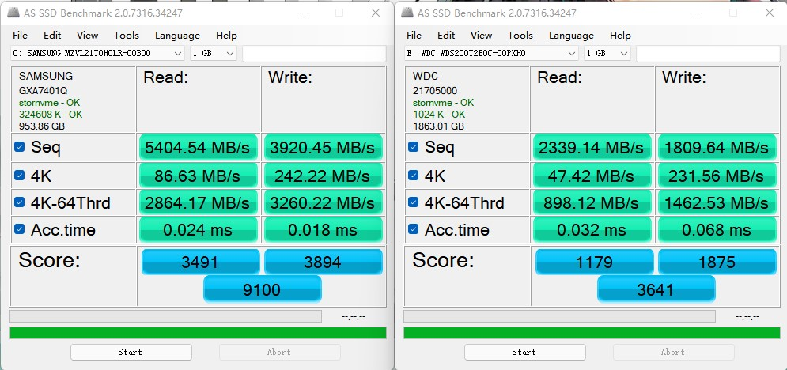

以上，就是我们社团对于笔记本优劣的评价体系，下面的内容就是我们电脑110俱乐部具体的推荐机型了，非常感谢您的阅读。此致敬礼！

#### **数据来源**

1.  讨论：如何理解「买电脑不能去实体店」的言论？
2.  视频：【笔吧】首发R7 5800U的电脑，惠普战66四代锐龙版评测
3.  视频：[【笔吧】商务本中的“小钢炮”，联想ThinkBook14p评测](https://www.bilibili.com/video/BV1A64y1v7Xq)
4.  视频：[【熊猫科普】双通道内存有啥用？16G对比8+8G谁强谁弱?](https://www.bilibili.com/video/BV1s54y1i7UX)
5.  视频：最新的DDR5内存比DDR4强多少？单条真的是双通道吗？【翼王】
6.  文章：[英伟达新款MX550测试出炉：R7-6800H核显水平，有4GB显存可选](https://m.ithome.com/html/606821.htm)
7.  文章：[小心掉坑！警惕第11代酷睿核显和MX450的雷区](https://www.cfan.com.cn/2020/1019/134433.shtml)
8.  视频：[中正评测：7499元，拯救者R7000P 2021游戏本开箱，R7-5800H/RTX3060](https://www.bilibili.com/video/BV1TA411L7ej)
9.  视频：【笔吧】华硕天选3首发评测：这一代进步很大！
10. 视频：[华硕天选2来了，R7-5800H+RTX3070首发评测【笔吧评测室】](https://www.bilibili.com/video/BV1Wv411s7nC)
11. 视频：[【硬件科普】显示器的色域和色准是什么东西？他会影响哪些体验](https://www.bilibili.com/video/BV1kk4y167rk)
12. 测试：PM9A1和SN550在AS SSD Benchmark Ver2.07316.34247中1GB的性能测试

## Part Ⅳ 具体机型推荐

欢迎同学你来到了我们的具体机型推荐环节！在这一环节当中，我们将会列出我们认为比较值得推荐的笔记本机型及它们的对应配置，不过考虑到一款机型模具可以对应多种配置，为方便同学你的阅读，我们将会列出我们主推荐的配置及我们对此的评价，同时给出次推荐配置所对应的价格与购买链接。同时需要同学你注意的是，在主要参数项目当中，质量将会优先采用实际测试值，厚度将采用最厚值及最薄值的平均值，因此可能会与厂商标注的参数有所不同，请你谅解。

### 【轻薄本】惠普 战66

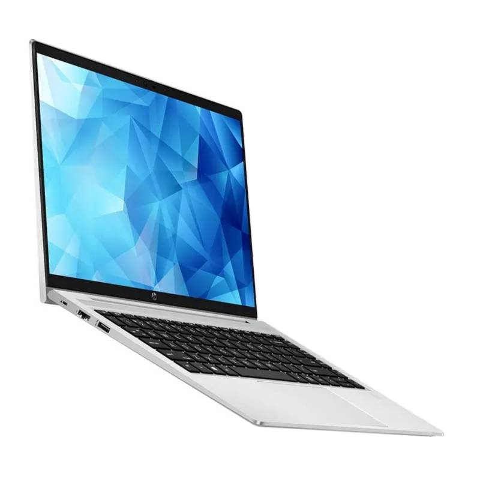

**主要参数**

| 项目     | 参数                                 |
|----------|--------------------------------------|
| 尺寸     | 14.5寸                               |
| 质量     | 1.38kg                               |
| 厚度     | 19.9mm                               |
| 处理器   | R5-5625U                             |
| 显卡     | Vega集成显卡                         |
| 存储     | 16G DDR4-3200MHz + 512G              |
| 屏幕     | 1920x1080；16:9；100%RGB高色域；60Hz |
| USB接口  | USB-A：5Gb/s x3；USB-C：10Gb/s x1    |
| 影音接口 | HDMI2.0；耳麦孔                      |
| 其他接口 | RJ45网口                             |
| 充电接口 | 65W DC电源接口                       |

**价格&购买链接**

主推荐：R5-5625U 16G+512G ￥4299  
[京东自营链接](https://item.jd.com/100032226552.html)

次推荐：i5-1240P 16G+512G ￥4599  
[京东自营链接](https://item.jd.com/100020480561.html)

**优点：**

1.  因为性能释放弱，所以风扇噪音小，同时拥有非常长的续航时间。
2.  内外拓展性都相当强大，能应付绝大多数用户在办公时的拓展需求。

**缺点：**

1.  机身开了指纹识别模块的孔位，却没有指纹识别功能。
2.  屏幕边框依然较同类产品较粗，颜值上稍逊一筹。
3.  额外硬盘位为2242规格，使得用户升级成本增高。

**总结:**  
战66一直拥有良好的内外部拓展性和续航时长，是一款典范级的办公、学习机器，也正因如此，苛责战66的屏幕分辨率和性能释放是不合适的。今年款的战66中，我们更推荐锐龙版，理由有二：一是虽然锐龙版依然搭载的是锐龙5000系列处理器，但是反过来思考，倘若其搭载了锐龙6000系列，新处理器及全新规格的内存必然将使其售价提高至5599甚至更高；二是第12代酷睿处理器在性能大幅提升的同时，其待机功耗实际要比锐龙5000系列处理器高许多，作为办公本来说并不是那么合适。但总体而言，对于绝大多数的老师和同学来说，他们其实并不需要这么极限的续航时间，因此，我们更建议你选择其他型号的机器。

### 【轻薄本】宏碁非凡s3 2022 i5

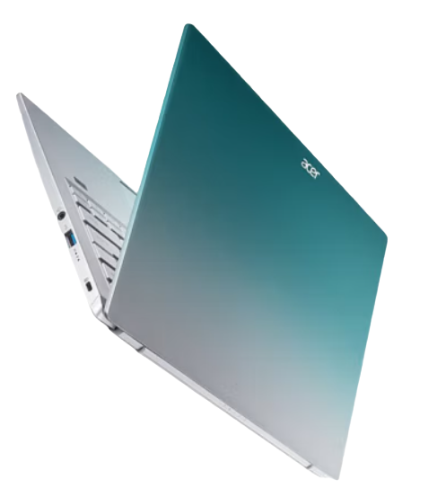

**主要参数**

| 项目      | 参数                                  |
|-----------|---------------------------------------|
| 尺寸      | 14.5寸                                |
| 重量      | 1.25kg                                |
| 厚度      | 16.6mm                                |
| 处理器    | i5-1240P                              |
| 显卡      | Xe集成显卡                            |
| 内存+硬盘 | 16G+512G(PCI-E 4.0)                   |
| 屏幕      | 2560\*1440；16:9；100%RGB高色域；60Hz |
| USB接口   | USB-A：5Gb/s x2；USB-C：雷电4 x2      |
| 影音接口  | HDMI 2.0；耳机孔                      |
| 充电接口  | 占用USB-C【65W Type-C电源接口】       |

**价格&购买链接**  
主推荐 i5-1240P￥4499-4599  
[京东自营链接](https://item.jd.com/100020236289.html)

**优点：**

1.  性能对于轻薄本的用户比较出色
2.  有雷电接口
3.  价格比较低，性价比高，扩展性比较好（有第二个硬盘位）

**缺点：**

1.  原装的固态硬盘性能一般
2.  雾面屏有比较强的油腻感
3.  浅色键盘+白色背光并不好看

**总结：**

一台其实没有什么特别好的优点的机器，可能唯一的硬件层面的优点是性能还不错，不过在它的价格面前，这台机器就是一个很好的选择，虽说续航比较一般，但是放在今年12代酷睿集体续航都比较差的情况下，倒也没那么离谱了，在意的同学也可以考虑等待AMD的轻薄本。

### 【轻薄本】华硕无双14 i5-12500H

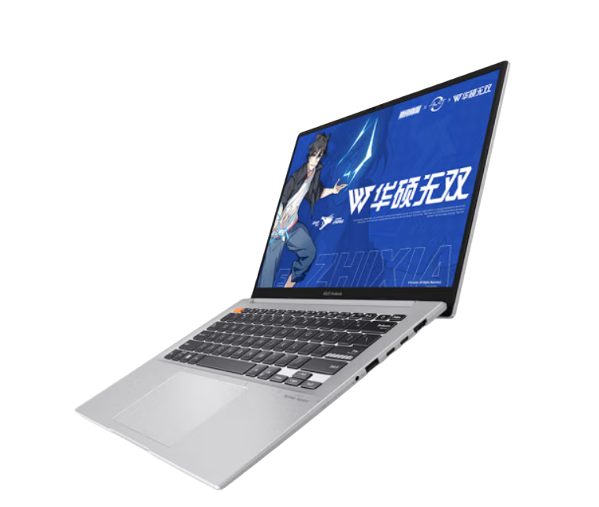

**主要参数**

| 项目      | 参数                                                      |
|-----------|-----------------------------------------------------------|
| 尺寸      | 14.5寸                                                    |
| 重量      | 1.64kg                                                    |
| 厚度      | 17.9mm                                                    |
| 处理器    | i5-12500H                                                 |
| 显卡      | Xe集成显卡                                                |
| 内存+硬盘 | 16G DDR4-3200MHz+512G                                     |
| 屏幕      | 2880x1800;16:10;90Hz;OLED材质;最高600nit;100%DCI-P3广色域 |
| USB接口   | USB-A：5Gb/s x1、480Mb/s x1；USB-C：雷电4 x2              |
| 影音接口  | HDMI 2.0；耳机孔                                          |
| 充电接口  | 占用USB-C 【90W Type-C】                                  |

**价格&购买链接**  
¥5199  
[京东自营链接](%20https://item.jd.com/100035200950.html)  
[华硕官网链接](%20https://www.asus.com.cn/store/product-5091.html)

**优点：**

1.  屏幕素质极其优秀，OLED屏，2880x1800（16：10），90/120hz,亮度420左右
2.  电池容量较大，续航时间长
3.  搭载两个高速的多功能的雷电4接口
4.  支持PD充电

**缺点：**

1.  键盘没有背光
2.  性能释放一般
3.  硬盘性能一般，但不影响日常使用
4.  OLED屏会烧屏，而Windows没有对OLED屏优化，屏幕长期显示的部分（例如任务栏）会烧屏，建议自行了解OLED屏工作原理

**总结：**

优点是OLED，缺点也是OLED，由于Windows没有对笔记本的OLED进行优化，所以为了防止烧屏，可能会需要自己进行一系列的设置，购买前一定要自行了解OLED屏幕的原理，防止烧屏之后引起的一些列麻烦问题。重量在14寸的笔记本中算是比较重的，但能够支持PD充电。比较看重屏幕素质的，且没有打游戏需求的同学可以购买。

### 【轻薄本】机械革命无界16

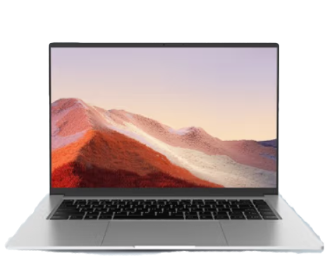

**主要参数**

| 项目      | 参数                                    |
|-----------|-----------------------------------------|
| 尺寸      | 16.1寸                                  |
| 重量      | 1.73kg                                  |
| 厚度      | 16.6mm                                  |
| 处理器    | i7-12700H                               |
| 显卡      | Xe集成显卡                              |
| 内存+硬盘 | 16G DDR4-3200MHz + 512G                 |
| 屏幕      | 2560x1600; 16:10; 100%sRGB高色域; 120Hz |
| USB接口   | USB-A : 5Gb/s x3; USB-C : 5Gb/s x2      |
| 影音接口  | HDMI 1.4 ;耳机孔                        |
| 充电接口  | 90W DC电源接口                          |

**价格&购买链接**

主推荐：i7-12700H ￥5299

[京东自营链接](https://item.jd.com/100018385485.html)

次推荐：i7-12700H+RTX2050 ￥6299  
[京东自营链接](https://item.jd.com/100033349128.html)

**优点：**

1.  屏幕素质优秀，2560x1600，16：10，120hz高刷，亮度370nit左右
2.  CPU在轻薄本范围内性能优秀（55w性能释放）
3.  支持加装2280规格的硬盘，内存为DDR4且支持更换升级
4.  支持PD充电

**缺点：**

1.  硬盘素质不算好（英特尔660p）
2.  机械革命品控和售后比较一般

**总结：**

适合预算不是很充足，目标是轻薄本的同学购买。机器做工，硬件配置，性能释放等在一众轻薄本里非常优秀，但机械革命的品控以及售后不是很好，购买时需要注意验机。

### 【轻薄本】 联想 Thinkbook14+

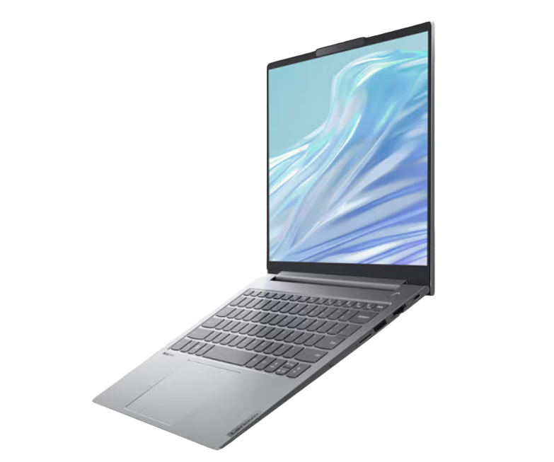

**主要参数**

| 项目      | 参数                                                      |
|-----------|-----------------------------------------------------------|
| 尺寸      | 14.5寸                                                    |
| 重量      | 1.45kg                                                    |
| 厚度      | 17.1mm                                                    |
| 处理器    | i5-12500H                                                 |
| 显卡      | RTX2050                                                   |
| 内存+硬盘 | 16G LPDDR5-4800MHz+512G                                   |
| 屏幕      | 2880x1800; 16:10; 100%sRGB高色域; 90Hz                    |
| USB接口   | USB-A : 5Gb/s x2、480Mb/s x1; USB-C : 雷电4 x1、10Gb/s x1 |
| 影音接口  | HDMI 2.0 ;耳机孔                                          |
| 其他接口  | RJ45网口 ; Micro SD 读卡器                                |
| 充电接口  | 占用USB-C 【100W Type-C】                                 |

**价格&购买链接**

主推荐：i5-12500H 16G+512G ￥5299  
[京东自营链接](https://item.jd.com/100020078921.html)

次推荐：i5-12500H RTX2050 ¥6299

[京东自营](https://item.jd.com/100035250898.html)链接

**优点**

1.  外部接口数目十分充足，种类齐全，拓展性强
2.  同类型产品中，综合性能释放较强
3.  2880x1800，16:10屏高色域屏幕，在同价位表现优秀
4.  机身内部有多余m.2硬盘位，方便后期升级
5.  支持100W PD充电
6.  隐藏式USB2.0接口，外接鼠标或键盘接收器时更加美观
7.  全金属机身，质感优秀

**缺点**

1.  原装适配器块头较大，略重，为三角插头，不便于携带
2.  由于独显,高分屏以及CPU的影响，续航能力较差
3.  缺货，有溢价情况

**总结**  
该机型具有优秀的性能释放、齐全的外部接口、质感优秀的机身做工，并且支持100w的PD充电，独显版能兼顾大学生在寝室打游戏以及带出门学习的需求。核显版表现优异，独显版兼顾游戏性能。但如果需要更高的游戏性能，建议还是买性能本更合适。推荐喜欢商务风格、看重机器做工的同学购买。

### 【轻薄本】 联想 ThinkBook16+

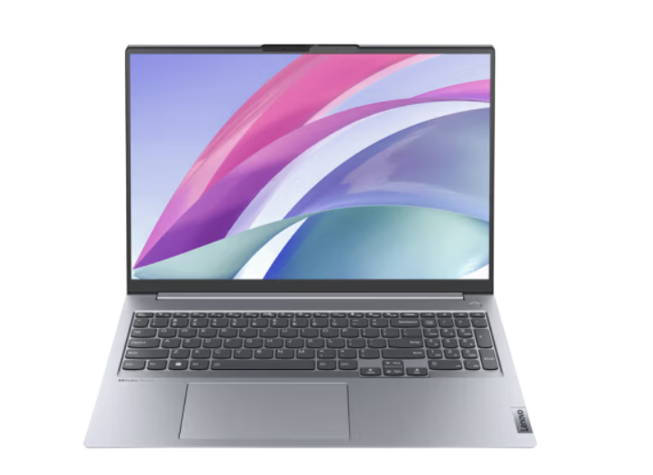

**主要参数**

| 项目      | 参数                                                      |
|-----------|-----------------------------------------------------------|
| 尺寸      | 16.1寸                                                    |
| 重量      | 1.8kg                                                     |
| 厚度      | 16.5mm                                                    |
| 处理器    | i5-12500H                                                 |
| 显卡      | RTX2050                                                   |
| 内存+硬盘 | 16G+512G                                                  |
| 屏幕      | 2560x1600; 16:10; 100%sRGB高色域; 120Hz                   |
| USB接口   | USB-A : 5Gb/s x2、480Mb/s x1; USB-C : 雷电4 x1、10Gb/s x1 |
| 影音接口  | HDMI 2.0 ;耳机孔                                          |
| 其他接口  | RJ45网口 ; Micro SD 读卡器                                |
| 充电接口  | 占用USB-C 【100W Type-C】                                 |

**价格&购买链接**

i5-12500H RTX2050 ￥6299

[京东自营](https://item.jd.com/100035229102.html)

**优点**

1.  外部接口数目十分充足，种类齐全，拓展性强
2.  机身内部有多余m.2盘位，方便后期升级
3.  2560x1600, 16:10的高色域，120Hz高刷屏，屏幕表现优秀
4.  支持100W PD充电
5.  隐藏式USB2.0接口，外接鼠标或键盘接收器时更加美观
6.  噪音控制优秀
7.  全金属机身，质感优秀

**缺点**

1.  原装type-C适配器块头较大，略重，为三角插头，不便于携带
2.  续航能力差
3.  缺货，有溢价情况

**总结**

该机型具有优秀的性能释放、齐全的外部接口、质感优秀的机身做工，并且支持100w的PD充电，能兼顾大学生在寝室打游戏以及带出门学习的需求，相比14寸机型携带性降低，屏幕更大，性能略有增强。如果你想要一台便携实用，同时兼顾一点游戏性能的全能型笔记本，那么这台电脑可以考虑一下。但如果需要更高的游戏性能，建议还是买性能本更合适。推荐喜欢商务风格、看重机器做工的同学购买。

### 【轻薄本】联想 小新Pro16 锐龙版

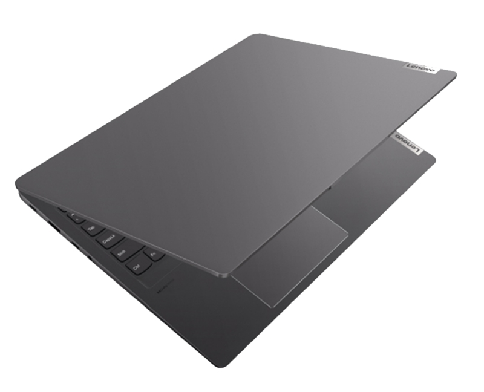

**主要参数**

| 项目     | 参数                                        |
|----------|---------------------------------------------|
| 尺寸     | 16.0寸                                      |
| 质量     | 1.97kg                                      |
| 厚度     | 16.6mm                                      |
| 处理器   | R7-6800H                                    |
| 显卡     | Radeon集成显卡                              |
| 存储     | 16G DDR5-6400MHz + 512GB                    |
| 屏幕     | 2560x1600；100%sRGB高色域；120Hz            |
| USB接口  | USB-A：5Gb/s x2；USB-C：10Gb/s x1；5Gb/s x1 |
| 影音接口 | HDMI2.0；耳麦孔                             |
| 其他接口 | SD卡槽                                      |
| 充电接口 | 100W PD电源接口                             |

**价格&购买链接**

主推荐：R7-6800H 16G+512G ￥5446   
[京东自营链接](https://item.jd.com/10052388349795.html)

**我们的评价**

优点：

1.  有着高达54W的性能释放，非常强势。
2.  屏幕素质相较于去年的版本有一定的提升。
3.  锐龙6000系列处理器的优异能耗比使其续航能力较强。

缺点：

1.  虽然说是轻薄本，但是重量已经来到了一些轻薄性能本的级别。
2.  没有搭载第二个M.2接口，为未来的硬盘加装造成了阻碍。

总结：  
去年的小新Pro16是名副其实的明星机型，由于诸多原因，其溢价甚至一度接近千元。不过今年供应链形势有所好转，搭载独立显卡的小新Pro16也自然失去了其生存的土壤，故我们仅推荐集成显卡版本的小新Pro16。今年的小新Pro16锐龙版配合锐龙6000系列处理器，有着强大的续航能力以及图形性能，这无疑是对学生党们的重大利好。只是，小新Pro16的质量已经来到了轻薄性能本的边界，其作为轻薄本而言还是相对较重了，而且小新Pro16并未提供第二个M.2接口，还有着计划报废的嫌疑。不过，对于那些希望选购一台续航良好的大屏轻薄本的同学而言，小新Pro16锐龙版和RedmiBookPro15锐龙版似乎他们在可接受价位段内的唯二解。

### 【性能本】惠普暗影精灵8

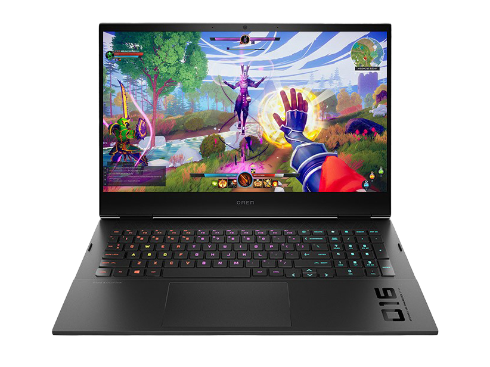

**主要参数**

| 项目      | 参数                                    |
|-----------|-----------------------------------------|
| 尺寸      | 16.1寸                                  |
| 重量      | 2.33kg                                  |
| 厚度      | 22.5-26mm                               |
| 处理器    | i7-12700H                               |
| 显卡      | Xe集成显卡/RTX3060(115W)                |
| 内存+硬盘 | 16G+512G                                |
| 屏幕      | 1920x1080；16:9；高色域；144Hz          |
| USB接口   | USB-A：5Gb/s x 3；USB-C：10Gb/s x1      |
| 影音接口  | HDMI 2.1；耳机孔；mini DP 1.4           |
| 其他接口  | RJ45网口【1 Gb/s】；SD 读卡器           |
| 充电接口  | 200W/230W DC电源接口【支持100W PD充电】 |

**价格&购买链接**

按照预算选择以下配置

i7-12700H+RTX3060 16G+512G ￥8299  
[京东自营链接](https://item.jd.com/100032391396.html)

i5-12500H+RTX3050Ti 144Hz 16G+512G ￥6699  
[京东自营链接](https://item.jd.com/100032721318.html)

**优点：**

1.  一线品牌，知名度高，同时性价比较高
2.  高负载情况下键盘温度控制较好
3.  性能释放有些许的进步
4.  货源充足，易购买

**缺点：**

1.  方向键半高，使用时略有不适
2.  并非满血显卡，性能距离满血有一定的差距(约4-8%)
3.  没有提供2560x1440屏幕供用户选择
4.  屏轴稳定性一般，转轴会存在脱胶的问题

**总结：**

没明显坑点的正常机器，结合品牌、定价、性能表现，算是台好机器。但是一定要注意加300块钱就能上144hz的屏幕了，体验和观感会好很多。如果追求极高功耗显卡，那这台电脑或许不是很适合你。

### 【性能本】宏碁 暗影骑士·擎 2022

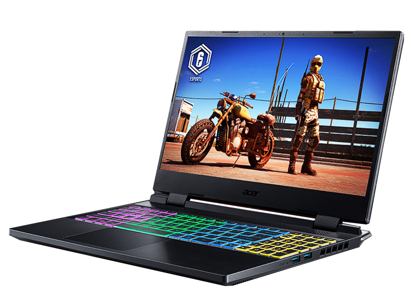

**主要参数**

| 项目      | 参数                                        |
|-----------|---------------------------------------------|
| 尺寸      | 15.6寸                                      |
| 重量      | 2.42kg                                      |
| 厚度      | 27.0mm                                      |
| 处理器    | i7-12700H                                   |
| 显卡      | Xe集成显卡/RTX 3060(140W)                   |
| 内存+硬盘 | 16G DDR4-3200MHz + 512G                     |
| 屏幕      | 2560x1440；16:9；100%DCI-P3广色域；165Hz    |
| USB接口   | USB-A：5Gb/s x2、10Gb/s x1；USB-C：雷电4 x1 |
| 影音接口  | HDMI 2.1；耳机孔                            |
| 其他接口  | RJ45网口                                    |
| 充电接口  | 230W DC电源接口                             |

**价格&购买链接**  
i7-12700H￥7999  
[京东自营链接](https://item.jd.com/100032964652.html)

**优点：**

1.  价格较为便宜（虽然已经涨价了），性价比较高
2.  屏幕是最直观的感受，2560\*1440 165Hz 100%DCI-P3的屏幕还是很让人舒适
3.  双烤功耗46W+133W，性能释放较好
4.  拥有一个雷电4接口，三个USB-A接口，接口丰富，扩展性好

**缺点：**

1.  高负载下噪音较为尖锐
2.  塑料机身，刚性一般，质感一般，且机器较为厚重
3.  屏幕下边框太宽，虽然模具外观有所改善，笔记本依旧颜值一般

**总结：**

性能没啥大问题，性价比也很好，机器的配置其实挺均衡的。基本是这个价位的主流水平，比如独显直连、PCIe4.0硬盘+多硬盘位、2.5K高色域高刷屏等，该有的基本都有了。但是电脑的噪音高负载下非常大，擎的噪音绝对不是你忍一忍就能ok的级别，绝大多数的时候你根本不能开性能模式。屏幕下边框黑边太长，许多人不喜欢这种设计。还有不爽的是做购机指南做到一半的时候涨价了三百块钱，但是也不影响这台机器的nice。

### 【性能本】机械革命极光Pro i7 3060

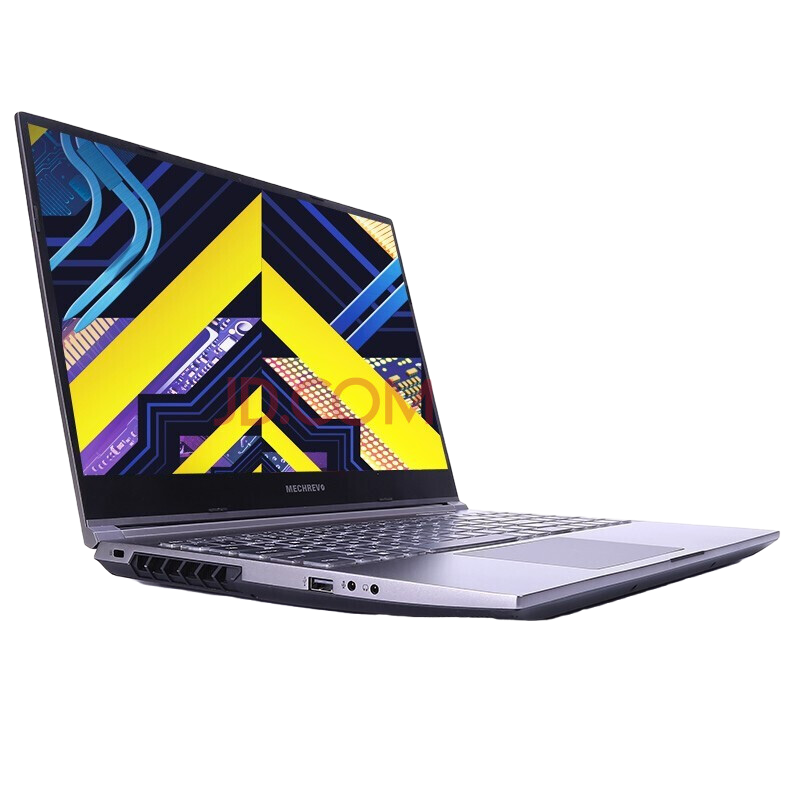

**主要参数**

| 项目      | 参数                                        |
|-----------|---------------------------------------------|
| 尺寸      | 15.6寸                                      |
| 重量      | 2.07kg                                      |
| 厚度      | 23.8mm                                      |
| 处理器    | i7-12700H                                   |
| 显卡      | Xe集成显卡/RTX 3060(140W)                   |
| 内存+硬盘 | 16G DDR5-4800MHz+512G                       |
| 屏幕      | 2560x1440；16:9；100%sRGB高色域；165Hz      |
| USB接口   | USB-A：5Gb/s x2、10Gb/s x1；USB-C：雷电4 x1 |
| 影音接口  | HDMI 2.1；耳机孔；麦克风孔                  |
| 其他接口  | 有线网口;SD读卡器                           |
| 充电接口  | 230W DC电源接口                             |

**价格&购买链接**  
i7-12700H￥7999  
[京东自营链接](https://item.jd.com/100032644690.html)

**优点：**

1.  机身相对的轻薄，携带较为舒适，颜值较好
2.  机械革命的产品性价比较高，不低的配置和实惠的价格很让人舒适
3.  2560x1440，165Hz的屏幕，观感较好

**缺点：**

1.  追求轻薄，使得散热能力一般。游戏中，显卡和CPU都会飚到八十几度
2.  机械革命的售后和品控距离一线大厂还有一定的差距，有革命失败的可能性
3.  价格经常左右摇摆，需要耐心等待一个较为完美的价格

**总结：**

看得出来，厂家想尽可能做一个没有槽点的机器。结合这个价格，也确实没有什么槽点。机器比较偏重显卡的性能释放，实际游戏也稍稍超过上一代满血版的3060。除了机械革命品控的问题，还需要注意的是机器在跑游戏的时候温度表现不尽人意，但这也是为了轻薄的模具带来的牺牲。内存硬盘没有缩水，性能给力，散热硬伤。重度游戏玩家需要谨慎考虑。

### 【性能本】华硕天选3

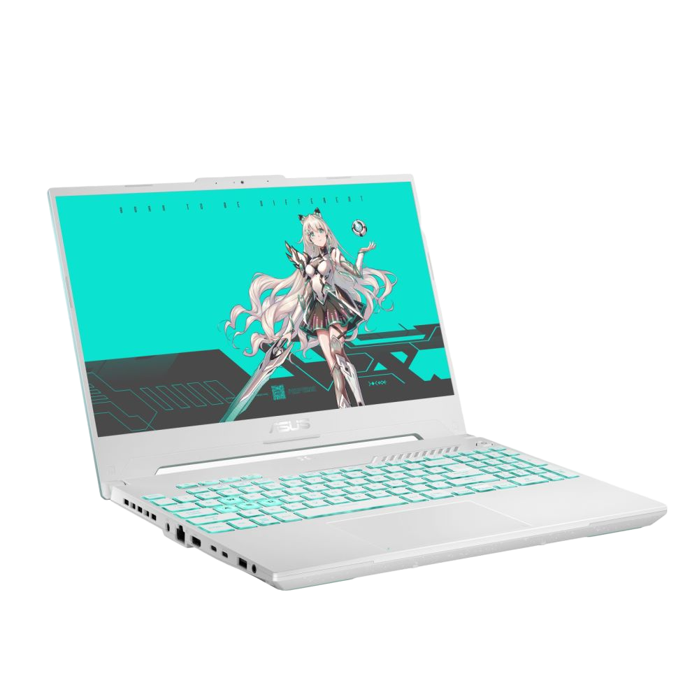

**主要参数**

| 项目      | 参数                                    |
|-----------|-----------------------------------------|
| 尺寸      | 15.6寸                                  |
| 重量      | 2.17kg                                  |
| 厚度      | 22.3-23.3mm                             |
| 处理器    | R7-6800H                                |
| 显卡      | RTX 3060(140W)                          |
| 内存+硬盘 | 16G+512G                                |
| 屏幕      | 1920x1080；16:9； 100%sRGB高色域；144Hz |
| USB接口   | USB-A：5Gb/s x2；USB-C：5Gb/s x2        |
| 影音接口  | HDMI 2.0b；耳机孔                       |
| 其他接口  | RJ45网口【1Gb/s】                       |
| 充电接口  | 240W DC电源接口                         |

**价格&购买链接**

R7-6800H 1920x1080￥7499  
[京东自营链接](https://item.jd.com/100020557141.html)

**优点：**

1.  CPU性能发挥很强
2.  相比同配置其他性能本机身很轻，手感较好，携带较为方便
3.  游戏表现较好，游戏流畅度高，游戏帧数优异

**缺点：**

1.  屏幕亮度一般，观感一般，游戏过程中视觉体验一般
2.  续航时间较短

**总结：**

天选3作为天选2的迭代版本，在解决了前代性能释放不足的基础上还进一步降低了机身的质量和厚度，虽然这使得高负载的噪音有所增加，但从总体上来看天选3相对于前代有全面的进步。除了英特尔版本价格较高和显示屏亮度较低之外，其他方面没有什么大问题了。游戏的跑分实测也较为优秀。

### 【性能本】惠普 暗影精灵8Pro

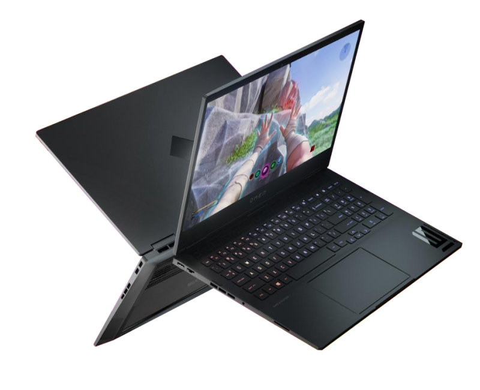

**主要参数**

| 项目     | 参数                             |
|----------|----------------------------------|
| 尺寸     | 16.1寸                           |
| 质量     | 2.40kg                           |
| 厚度     | 20.2mm                           |
| 处理器   | i7-12700H                        |
| 显卡     | Xe集成显卡/RTX3060(140W)         |
| 存储     | 16G DDR5-4800MHz + 512GB         |
| 屏幕     | 1920x1080；100%sRGB高色域；144Hz |
| USB接口  | USB-A：5Gb/s x3；USB-C：雷电4 x2 |
| 影音接口 | HDMI2.0；耳麦孔                  |
| 其他接口 | RJ45网口；SD卡槽                 |
| 充电接口 | 280W DC电源接口                  |

**价格&购买链接**

主推荐：i7-12700H+RTX3060 144Hz 16G+512G ￥7999  
[京东自营链接](https://item.jd.com/100021389125.html)

次推荐：i7-12700H+RTX3050Ti 144Hz 16G+512G ￥6999  
[京东自营链接](https://item.jd.com/100021389115.html)

**我们的评价**

优点：

1.  支持100W的PD充电，有着相对良好的的便携性。
2.  键盘温度控制较好，在高负载下键盘温度也依然较低。
3.  散热模块有所更新，使其显卡终于可以解锁最大140W的功耗。
4.  作为一线厂商的产品，溢价极低，而且在目前看来一直保持有货状态。

缺点：

1.  作为Pro版本，在屏幕配置上却依然采用了大下巴的设计，稍有遗憾。
2.  虽然触摸板面积有所增大，但是键盘布局依然为人诟病，希望后续有改进。

总结：  
作为暗影精灵8的后续升级版本产品，我们看到了惠普在这款机器上的诚意。相对于前者，暗影精灵8Pro的散热性能增强、接口规格升级、触摸板面积增大、机身结构有所优化，但却依然保持了较低的售价，甚至在目前要低于同基础配置的暗影精灵8，是真正加量不加价的好产品。不过有些可惜的是，暗影精灵8Pro的走量版本依然提供的是1080P屏幕，也保留着大下巴的设计；同时一直为人诟病的键盘布局也没有得到改善，稍显可惜。不过这些小瑕疵并不能更改暗影精灵8Pro是目前性价比最高，最值得购买的一线品牌性能本的事实。

### 【性能本】联想Y9000P i7+3060

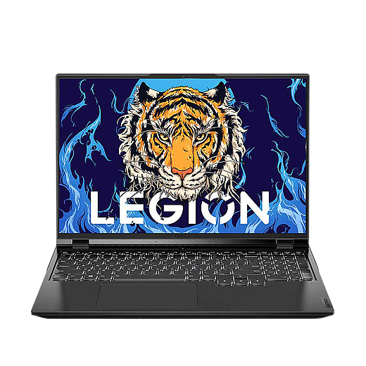

**主要参数**

| 项目      | 参数                                                                    |
|-----------|-------------------------------------------------------------------------|
| 尺寸      | 16.1寸                                                                  |
| 重量      | 2.53kg                                                                  |
| 厚度      | 19.9-26.1mm                                                             |
| 处理器    | i7-12700H                                                               |
| 显卡      | RTX 3060(140W)                                                          |
| 内存+硬盘 | 16G+512G                                                                |
| 屏幕      | 2560x1600;165Hz;500nits;高色域100%sRGB                                  |
| USB接口   | USB-A：5Gb/s x3；USB-C：雷电4 x1、10Gb/s x2【支持DP1.4】                |
| 影音接口  | HDMI 2.1；耳机孔                                                        |
| 其他接口  | RJ45网口【2.5Gb/s】                                                     |
| 充电接口  | 300W DC电源接口【支持100W/135W PD充电(135W需使用联想拯救者便携适配器)】 |

**价格&购买链接**  
i7-12700H ¥8999  
[京东自营链接](https://item.jd.com/100019125569.html)  
[联想官网链接](https://item.lenovo.com.cn/product/1020769.html)

**优点**

1.2560x1440+165hz+500nits高素质窄边框屏幕

2.接口数量丰富，支持100wPD充电，135w便携适配器充电（需要另外购买拯救者C135适配器）

3.硬件性能释放强劲，散热表现较好，高负载情况下键盘温度控制较好

4.键盘设计合理，使用较为舒适

**缺点**

1.价格偏高，且促销时不易抢到

2.整机2.53kg，原装适配器1.04kg，偏重

3.内存延迟稍高

4.续航时间缩短

**总结**

拯救者是性能本的标杆、热门产品。新款机器较2021版而言有小幅提升和优化，软件控制、性能释放与散热均有所进步，但与其他机型不再有明显优势；日常价格偏高，促销难以抢到，在今年笔记本的市场上失去了一些竞争力。除非你财力雄厚，否则其他品牌的机型更值得推荐。

### 【性能本】魔霸新锐 R9+3060

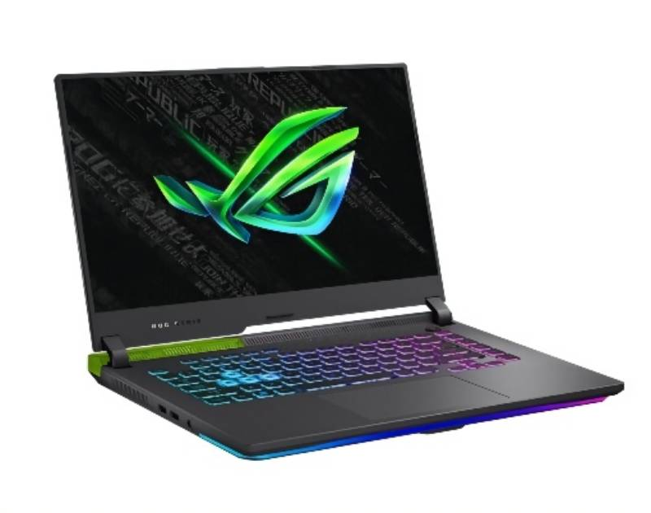

**主要参数**

| 项目      | 参数                                              |
|-----------|---------------------------------------------------|
| 尺寸      | 15.6寸                                            |
| 重量      | 2.34kg                                            |
| 厚度      | 27mm                                              |
| 处理器    | R9-6900HX                                         |
| 显卡      | RTX 3060                                          |
| 内存+硬盘 | 16G+512G                                          |
| 屏幕      | 2560x1440;165Hz;100%DCI-P3高色域                  |
| USB接口   | USB-A：5Gb/s x2；USB-C：10Gb/s x2【支持PD DP1.4】 |
| 影音接口  | HDMI 2.0b；耳机孔                                 |
| 其他接口  | RJ45网口【2.5Gb/s】                               |
| 充电接口  | 240W DC电源接口【支持100W PD充电】                |

**价格&购买链接**  
京东￥8999  
[京东自营链接](https://item.jd.com/100032980136.html)

**优点**

1.键盘四分区RGB+一圈氛围灯可调灯效+ROG发光LOGO（信仰！）

2.液金导热+140w3060+超频R9，性能释放较强

3.支持双显三模，外出时可切换成集显增加续航

3.2560x1440+165hz+P3广色域屏幕

**缺点**

1.方向键半高，使用时略有不适

2.右侧没有接口分布

3.不含摄像头

**总结**

较2021版，机身红黑配色转为绿黑，外观方面考虑个人主观；同时提升了屏幕分辨率与独显直连，增强的性能表现，在ROG系列中属于有性价比的机型（信仰！），各方面综合素质均较高。 但键盘布局方面没有小键盘，需要考察个人喜好；以及摄像头的缺失对办公及网课会议方面有所拖累。

### 【性能本】ROG 幻16

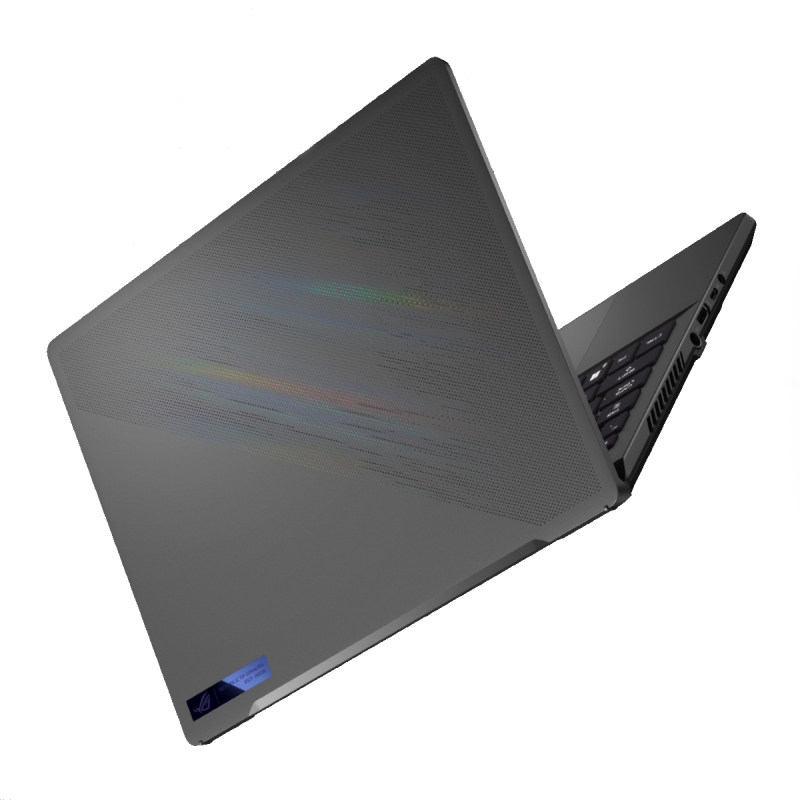

**主要参数**

| 项目     | 参数                                         |
|----------|----------------------------------------------|
| 尺寸     | 16.0寸                                       |
| 质量     | 2.08kg                                       |
| 厚度     | 19.9mm                                       |
| 处理器   | i7-12700H                                    |
| 显卡     | Xe集成显卡/RTX3060(120W)                     |
| 存储     | 16G DDR5-4800MHz + 512GB                     |
| 屏幕     | 2560x1600；100%DCI-P3广色域；165Hz           |
| USB接口  | USB-A：10Gb/s x2；USB-C：雷电4 x1；10Gb/s x1 |
| 影音接口 | HDMI2.0；耳麦孔                              |
| 其他接口 | RJ45网口；microSD卡槽                        |
| 充电接口 | 240W DC电源接口                              |

**价格&购买链接**

主推荐：i7-12700H+RTX3060 16G+512G ￥9999  
[京东自营链接](https://item.jd.com/100018322085.html)

**我们的评价**

优点：

1.  支持PD充电，有良好的的便携性。
2.  机身有着幻系列一如既往的家族设计风格，很有品质感。
3.  屏幕素质极好，能够充分满足绝大多数用户的办公、娱乐需求。

缺点：

1.  只有在高性能模式下才能实现整机145W的性能释放，代价是噪音非常大。
2.  机身键盘面类肤质涂层在长期使用后存在老化现象，长期使用效果不佳。
3.  机身大小限制了内存的加装，加装超过8GB的内存条只能组成不对称双通道。

总结：  
幻16作为去年的首次亮相的新产品，在今年做出了对于处理器和模具的正常更新。该机作为一款重量为不到2.1Kg的16寸机型，却能够在最大性能模式下实现高达145W的性能释放，而且屏幕素质非常好，可以称得上是最为全能的轻薄性能本，而且价格在同类型产品的价格当中还能显露出一定的性价比，这无疑是值得肯定的。不过，要想实现这样的性能释放，必然要做出相应的妥协，幻16的拓展性稍差，同时在最大性能模式下有着巨大的噪声。因此，倘若同学你的主要需求是为了玩游戏，并且对于便携性没有太大要求，我们其实更建议你购买一台正经规格的性能本。

### 【性能本】ROG 幻14

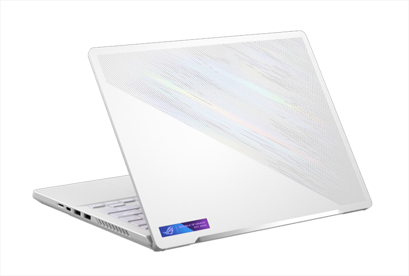

**主要参数**

| 项目     | 参数                               |
|----------|------------------------------------|
| 尺寸     | 14.5寸                             |
| 质量     | 1.72kg                             |
| 厚度     | 19.5mm                             |
| 处理器   | R7-6800HS                          |
| 显卡     | Radeon集成显卡/RX6700S(100W)       |
| 存储     | 16G DDR5-4800MHz + 512GB           |
| 屏幕     | 2560x1600；100%DCI-P3广色域；120Hz |
| USB接口  | USB-A：10Gb/s x2；USB-C：10Gb/s x2 |
| 影音接口 | HDMI2.0；耳麦孔                    |
| 其他接口 | microSD卡槽                        |
| 充电接口 | 240W DC电源接口                    |

**价格&购买链接**

主推荐：R7-6800HS+RX6700S 光显矩阵屏 16G+512G ￥11499  
[京东自营链接](https://item.jd.com/100032980146.html)

次推荐：R7-6800HS+RX6700S 16G+1TB ￥10499  
[京东自营链接](https://item.jd.com/100018561255.html)

**我们的评价**

优点：

1.  支持PD充电，有着良好的外出便携性。
2.  内敛的机身线条配合张扬的光显矩阵屏，整机颜值非常高。
3.  实现了高达115W的总性能释放，是名副其实的性能小钢炮。
4.  屏幕素质极好，能够充分满足绝大多数用户的办公、娱乐需求。
5.  相比于前代，搭载了支持人脸识别功能的摄像头，实用性有所提高。

缺点：

1.  网卡为联发科MT7922，这在上万元的产品当中很不应该。
2.  机身键盘面类肤质涂层在长期使用后存在老化现象，长期使用效果不佳。
3.  机身大小限制了内存的加装，加装超过8GB的内存条只能组成不对称双通道。

总结：  
幻系列作为ROG于前年开始推出的轻薄性能本产品，凭借独特的轻薄机身设计和相对强劲的性能释放，吸引了许多消费者的注意。今年的幻14相对于先前的版本，脱离了以往的电竞元素，在机身设计、屏幕比例、外设等多个角度做出了更为实用化的改进；同时其机身正面的光显矩阵屏也得到了升级，在内敛和张扬之间实现了一种独到的平衡，能够凸显出用户的个性。然而，今年的幻14依然存在一些缺点，一是作为一台主打创意设计的笔记本电脑，全面拥抱AMD平台的幻14虽然在能耗比上有着一定的提升，但是在Adobe等生产力软件当中的表现稍逊于搭载RTX3060显卡的产品；而作为一台售价上万的机器，幻14的无线网卡居然还是MTK的MT7922，而不是intel的AX200或者AX210，省这不到一百元的成本是很不应该的。不过我们必须说明，今年的幻14的的确确是一台好机器，倘若你十分在意笔记本的便携性能，对笔记本的性能有一定的追求，同时预算充足，幻14值得考虑。
